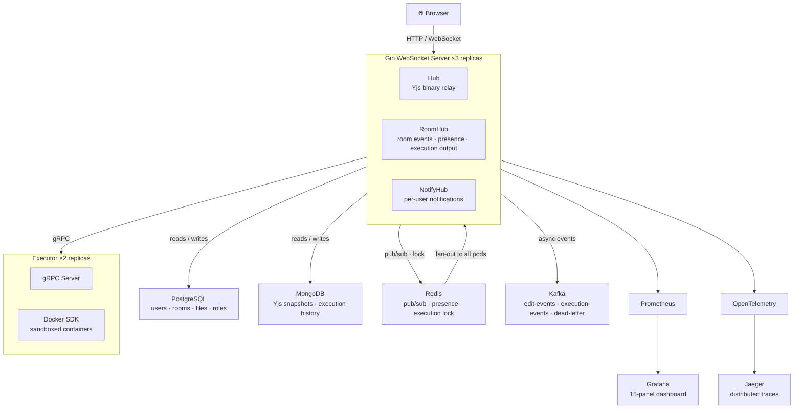
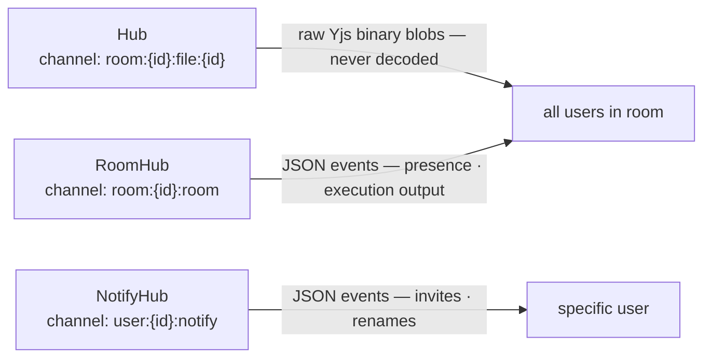
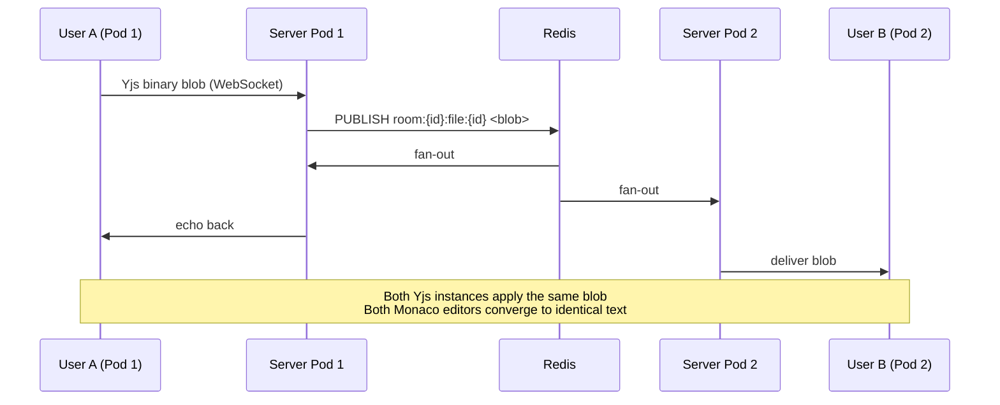
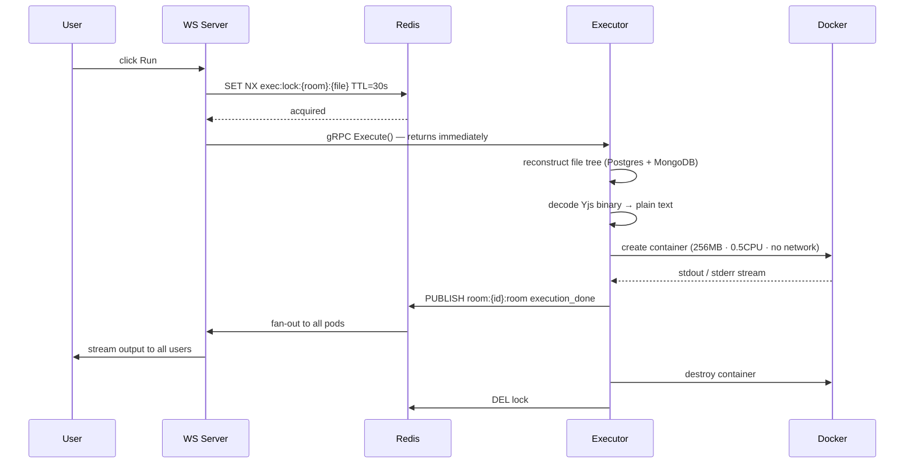
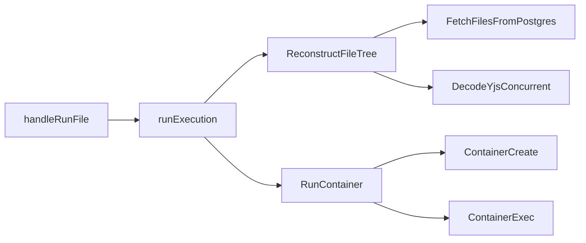
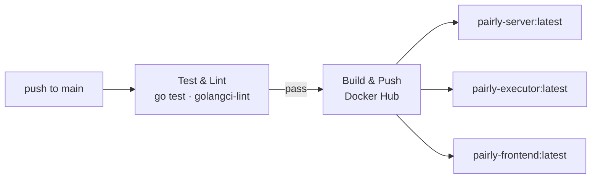

<div align="center">

# Pairly

**Open a URL. Share it. Code together.**

[](https://github.com/Nr-009/Parily/actions/workflows/deploy.yml)


<video src="https://github.com/user-attachments/assets/8c37ea53-461c-49fa-852f-9b2cbb0d50a5" autoplay loop muted playsinline width="100%"></video>

[Getting Started](#getting-started) · [Architecture](#architecture) · [How It Works](#how-it-works) · [Observability](#observability) · [Load Testing](#load-testing) · [Deployment](#aws-deployment)

</div>

---

## What is Pairly?

Multiple developers open the same URL and edit code simultaneously — seeing each other's cursors in real time. Any user clicks **Run** and the output streams live to everyone in the room, executed inside an isolated Docker container that is destroyed the moment execution ends.

The interesting part is not the editor. It is keeping every client in sync across horizontally scaled WebSocket servers, coordinating sandboxed execution without race conditions, and recording every edit as a replayable event log — all running on Kubernetes with a full observability stack.

---

## Table of Contents

- [Features](#features)
- [Architecture](#architecture)
- [Technology Stack](#technology-stack)
- [How It Works](#how-it-works)
  - [Real-Time Sync](#real-time-sync)
  - [Code Execution](#code-execution)
- [Getting Started](#getting-started)
  - [Docker Compose](#docker-compose)
  - [Kubernetes — Minikube](#kubernetes--minikube)
- [Observability](#observability)
- [Load Testing](#load-testing)
- [CI/CD](#cicd)
- [AWS Deployment](#aws-deployment)
- [Project Structure](#project-structure)

---

## Features

**Collaboration**
- Real-time collaborative editing — multiple users on the same file simultaneously with Yjs CRDT conflict resolution
- Live cursor tracking — see every user's cursor position and text selection in Monaco with colored overlays
- Presence indicators — colored dots showing who is online, updated via heartbeat every 10 seconds
- Multi-file rooms — each room supports multiple files, each with its own independent Yjs document and Redis channel
- File tree — create folders and nested file structures with parent-child relationships

**Code Execution**
- Sandboxed execution — code runs in an isolated Docker container with 256 MB RAM, 0.5 CPU, 10s timeout, no network access
- Live output streaming — stdout and stderr stream line by line to all users in the room simultaneously
- Execution history — scroll through previous runs per file with full output preserved in MongoDB
- Multi-language support — Python, JavaScript, TypeScript, Go, Java
- Race condition prevention — Redis SET NX lock ensures only one container runs per file at a time

**Room & File Management**
- Role-based access control — three roles enforced server-side on every operation:
  - `owner` — full control: delete room, manage members, edit code, run code
  - `editor` — edit code, run code
  - `viewer` — read-only, edits rejected at the WebSocket handler
- Member management — add members by user ID, change roles, remove members
- Room operations — create, rename, delete rooms; leave a room without deleting it
- File operations — create, rename, soft delete (recoverable), permanent delete
- Real-time notifications — room invites, renames, and deletions delivered instantly via NotifyHub

**Auth**
- Google OAuth2 — redirect flow, server never sees passwords, JWT issued on callback
- Email / password — Bcrypt hashed, same JWT flow
- JWT in httpOnly cookie — never accessible to JavaScript, survives page refresh
- Stateless sessions — multiple simultaneous logins from different browsers work independently

**Version History**
- Full event log — every edit published to Kafka as an ordered, persistent event
- Point-in-time replay — reconstruct the exact document state at any version by replaying Yjs blobs in order
- Snapshot cache — MongoDB caches decoded plain-text snapshots per version for instant retrieval on repeat access

**Observability**
- 15-panel Grafana dashboard — WebSocket connections, execution rate, cache hit ratio, HTTP latency p50/p95/p99
- Distributed tracing — every request traced end-to-end across both services via OpenTelemetry and Jaeger
- Prometheus metrics — separate metric sets for server and executor, scraped every 15 seconds
- Health endpoints — `/health/live` and `/health/ready` with real database pings used as Kubernetes probes

---

## Architecture



**Three WebSocket hubs — each with its own Redis channel:**



---

## Technology Stack

| Technology | Why |
|------------|-----|
| **Go + Gin** | Goroutines are cheap — one per WebSocket connection handles thousands of concurrent users with low memory overhead. The goroutine-per-connection model maps directly onto the fan-out pattern of pub/sub. |
| **Yjs CRDT** | Two users typing simultaneously produce conflicting edits. Yjs assigns every character a unique ID instead of tracking positions — "insert after character [userA, 42]" means the same thing on every machine regardless of what other edits happened concurrently. All clients converge mathematically. |
| **Redis pub/sub** | WebSocket connections are sticky. User A connects to Pod 1, User B to Pod 2. Without a shared bus they cannot communicate. Redis fans each edit out to every subscribed pod instantly. Pods subscribe only to channels for rooms with active local users — zero wasted messages. |
| **PostgreSQL** | Users, rooms, roles, and files are relational data with clear foreign key relationships. Joins, constraints, and transactions enforced at the database level. Schema versioned via golang-migrate — never applied manually. |
| **MongoDB** | Yjs document state is a binary blob of variable size. Execution history is schema-flexible. MongoDB stores both as-is without forcing a rigid structure on data that has none. |
| **Kafka** | Every edit and every execution is a persisted, ordered event. Replay all edit events for a room in order into a fresh Yjs instance and you reconstruct the exact document state at any point in time. Kafka sits on the side of the critical path — remove it and real-time sync still works. |
| **Docker sandbox** | User code runs inside a fresh container per execution: 256 MB RAM, 0.5 CPU, 10 second timeout, no network, no new privileges, non-root user. Destroyed immediately after. This is the same approach used by LeetCode, HackerRank, and Replit. |
| **gRPC (Server → Executor)** | Typed `.proto` contract. Binary encoding instead of JSON. The executor is never public-facing — gRPC is the right fit for internal service-to-service communication where the contract is stable and performance matters. |
| **OpenTelemetry + Jaeger** | A single user click produces a distributed trace that crosses two services: WS receive → Redis publish → gRPC call → Docker exec → Kafka publish → WS broadcast. Every span is visible in Jaeger with exact timing. |
| **Kubernetes + HPA** | WebSocket server auto-scales 3 to 10 pods on CPU. Executor scales 2 to 6 pods independently. StatefulSets give data services stable network identities and persistent volumes. Graceful shutdown drains in-flight connections before pod termination. |

---

## How It Works

### Real-Time Sync



> The server never decodes, inspects, or modifies Yjs blobs. If it did, encoding differences would cause clients to silently diverge. The server is a dumb pipe — Yjs handles all conflict resolution on the client.

### Code Execution



**Supported languages:** Python · JavaScript · TypeScript · Go · Java

---

## Getting Started

### Prerequisites

- Docker and Docker Compose
- For Kubernetes: Minikube and kubectl

### Docker Compose

```bash
# Clone
git clone https://github.com/Nr-009/Parily.git
cd Parily

# Configure
cp .env.example .env
# Fill in JWT_SECRET, GOOGLE_CLIENT_ID, GOOGLE_CLIENT_SECRET

# Run
docker-compose up --build
```

| Service | URL |
|---------|-----|
| Frontend | http://localhost:5173 |
| Backend | http://localhost:8080 |
| Grafana | http://localhost:3000 |
| Jaeger | http://localhost:16686 |
| Prometheus | http://localhost:9090 |

---

### Kubernetes — Minikube

**1. Start the cluster**
```bash
minikube start --driver=docker
```

**2. Two terminals — keep both running throughout**
```bash
# Terminal A
minikube tunnel

# Terminal B
minikube mount ./grafana/provisioning:/grafana/provisioning
```

**3. Create secrets — one time only**
```bash
cp k8s/secrets.example.yaml k8s/secrets.yaml
# Fill in: POSTGRES_PASSWORD · JWT_SECRET
#          GOOGLE_CLIENT_ID · GOOGLE_CLIENT_SECRET · GRAFANA_ADMIN_PASSWORD
```

**4. Deploy everything**
```bash
./k8s/apply.sh
```

**5. Watch pods come up**
```bash
kubectl get pods -n pairly -w
```

> Prometheus is ClusterIP — access via port-forward:
> ```bash
> kubectl port-forward service/prometheus 9090:9090 -n pairly
> ```

---

## Observability

### Grafana

Navigate to `http://localhost:3000` → Dashboards → **Pairly** (admin / admin)


<details>
<summary>View all 15 panels</summary>

| Section | Panels |
|---------|--------|
| **Collaboration** | Active WebSocket connections · Active rooms · Room joins/min |
| **Yjs / Snapshot Cache** | Saves/sec · Dedup skips · Cache hit ratio |
| **Code Execution** | Executions/min · Duration histogram · Timeout rate |
| **HTTP** | Request rate · Latency p50/p95/p99 by endpoint |
| **Infrastructure** | Kafka publish errors · Redis publish errors |

</details>

### Jaeger

Navigate to `http://localhost:16686` → Select `pairly-server` or `pairly-executor`


Every request produces a full trace across both services:



---

## Load Testing

```bash
brew install k6
```

Before running, generate a valid JWT token by logging in and copying it from the cookie, then set it in `load-tests/k6.js`:

```js
// load-tests/k6.js — set your token here before running
const TOKEN = 'your_jwt_token_here'
```

Then run:

```bash
k6 run load-tests/k6.js
```

| Scenario | VUs | What it verifies |
|----------|-----|-----------------|
| `websocket_connections` | 25 | Redis pub/sub throughput under concurrent WS load |
| `simultaneous_saves` | 10 | MongoDB dedup — identical Yjs blobs are skipped, not double-saved |
| `concurrent_executions` | 15 | Redis execution lock — no two containers run for the same file simultaneously |

---

## CI/CD

Every push to `main`:



Deploy after the pipeline completes:
```bash
./k8s/apply.sh   # builds images · pushes · applies manifests · restarts pods
```

> The pipeline does not auto-deploy because GitHub Actions cannot reach a local Minikube cluster. For cloud deployment, add a `kubectl rollout restart` step pointing at a reachable cluster.

---

## AWS Deployment

Terraform files in `terraform/` replace every Kubernetes StatefulSet with a managed AWS service:

| Kubernetes | AWS |
|------------|-----|
| postgres StatefulSet | RDS PostgreSQL 16 Multi-AZ |
| mongodb StatefulSet | DocumentDB 5.0 (primary + replica) |
| redis StatefulSet | ElastiCache Redis 7 |
| kafka StatefulSet | MSK Managed Kafka |
| EKS node groups | t3.medium (general) · t3.large (executor) |

```bash
cd terraform
cp terraform.tfvars.example terraform.tfvars
# fill in passwords and AWS region
terraform init && terraform plan && terraform apply
```

---

## Project Structure

```
Pairly/
├── backend/
│   ├── cmd/
│   │   ├── server/main.go          Gin router · 3 WS hubs · graceful shutdown 25s
│   │   └── executor/main.go        gRPC server · Docker · WaitGroup shutdown 30s
│   ├── internal/
│   │   ├── auth/                   JWT · Google OAuth · middleware
│   │   ├── config/                 Viper (server + executor)
│   │   ├── executor/               File tree reconstruction · Yjs decode · Docker SDK
│   │   ├── health/                 /health/live · /health/ready (real DB pings)
│   │   ├── kafka/                  Producer · edit / execution / dead-letter events
│   │   ├── metrics/                Prometheus definitions (InitServer / InitExecutor)
│   │   ├── mongo/                  Yjs documents · executions · snapshots
│   │   ├── postgres/               Rooms · files · members
│   │   ├── redis/                  Pub/sub · presence · execution lock
│   │   ├── rooms/                  HTTP handlers for all REST endpoints
│   │   ├── tracing/                OpenTelemetry + Jaeger OTLP init
│   │   └── websocket/              Hub · RoomHub · NotifyHub + handlers
│   ├── migrations/                 golang-migrate SQL (8 versioned migrations)
│   └── proto/                      executor.proto gRPC contract
├── frontend/
│   └── src/
│       ├── components/             Editor · Terminal · FileTabs · Presence
│       └── hooks/                  useYjs · useRoomSocket
├── k8s/
│   ├── websocket-server/           Deployment · LoadBalancer · HPA 3-10
│   ├── executor/                   Deployment · ClusterIP · HPA 2-6
│   ├── postgres/ mongodb/
│   │   redis/ kafka/               StatefulSets with PVCs
│   ├── prometheus/ grafana/
│   │   jaeger/                     Observability stack
│   ├── apply.sh                    build · push · apply · rollout restart
│   └── destroy.sh                  full teardown
├── terraform/                      AWS EKS infrastructure as code
├── load-tests/k6.js                3 scenarios: WS · dedup · execution lock
├── grafana/provisioning/           Auto-provisioned datasource + dashboard
├── prometheus.yml                  Scrape config (backend:8080 · executor:2112)
└── docker-compose.yml
```

---

## Environment Variables

Copy `.env.example` → `.env`. For Kubernetes copy `k8s/secrets.example.yaml` → `k8s/secrets.yaml` (gitignored).

| Variable | Description |
|----------|-------------|
| `JWT_SECRET` | Long random string for signing tokens |
| `GOOGLE_CLIENT_ID` | Google Cloud Console → APIs & Services → Credentials |
| `GOOGLE_CLIENT_SECRET` | Google Cloud Console → APIs & Services → Credentials |
| `GOOGLE_REDIRECT_URL` | `http://localhost:8080/auth/callback` |
| `POSTGRES_PASSWORD` | PostgreSQL password |
| `GRAFANA_ADMIN_PASSWORD` | Grafana admin UI password |

---

<div align="center">

Go · React · Yjs · Redis · PostgreSQL · MongoDB · Kafka · Docker · Kubernetes · Prometheus · Grafana · OpenTelemetry · Jaeger · GitHub Actions · Terraform

</div>